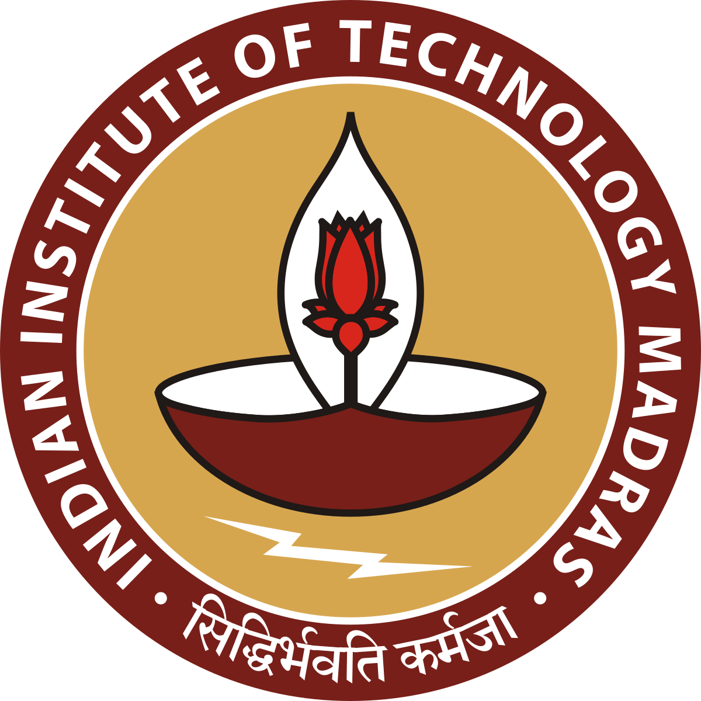

## Hi there 👋

<!--
**CrackGate27/CrackGate27** is a ✨ _special_ ✨ repository because its `README.md` (this file) appears on your GitHub profile.

Here are some ideas to get you started:

- 🔭 I’m currently working on ...
- 🌱 I’m currently learning ...
- 👯 I’m looking to collaborate on ...
- 🤔 I’m looking for help with ...
- 💬 Ask me about ...
- 📫 How to reach me: ...
- 😄 Pronouns: ...
- ⚡ Fun fact: ...
-->
# GATE 2027 Unofficial Website

  
*Organized by IIT Madras – Empowering Engineering Aspirants*

  
  

## Table of Contents
- [About](#about)
- [Features](#features)
- [Tech Stack](#tech-stack)
- [Usage](#usage)
- [License](#license)
- [Contact](#contact)

## About
This repository contains the source code for the official GATE 2027 exam website, organized by IIT Madras. GATE (Graduate Aptitude Test in Engineering) is a prestigious national-level examination for admissions to M.Tech programs and recruitment in Public Sector Undertakings (PSUs). The website provides essential information, registration, resources, and updates for aspirants.

- **Exam Dates**: [Insert Tentative Dates, e.g., February 2027]
- **Organizer**: IIT Madras
- **Official Site**: [Link to live site, e.g., https://gate2027.iitm.ac.in]

For more details, visit the [official GATE website](https://iitm.ac.in).

## Features
- **Responsive Design**: Optimized for desktop, tablet, and mobile devices.
- **User Registration**: Secure application form with payment integration.
- **Resource Hub**: Syllabus, sample papers, mock tests, and study materials.
- **Results Portal**: Access to scorecards, answer keys, and notifications.
- **Multilingual Support**: English and Hindi interfaces.
- **Accessibility**: WCAG-compliant for inclusive access.
- **Security**: SSL encryption, CAPTCHA, and data privacy compliance.
- **Admin Dashboard**: For IIT Madras officials to manage content and announcements.

## Tech Stack
- **Frontend**: HTML5, CSS3, JavaScript (ES6+)
- **Frameworks**: Bootstrap for responsive design; React.js for dynamic components (optional for advanced features).
- **Backend**: Node.js with Express (for server-side logic, if needed).
- **Database**: MongoDB or PostgreSQL for user data and results.
- **Hosting**: AWS S3 or GitHub Pages for static hosting; secure servers for dynamic content.
- **Tools**: Git for version control, ESLint for code quality, and Jest for testing.

## Usage
- **For Aspirants**: Navigate the site to register, download resources, and check results.
- **For Developers**: Modify HTML/CSS/JS files in the `src/` directory. Use the admin panel (if implemented) for content updates.
- **API Endpoints** (if applicable): Refer to `api/` folder for backend routes.

Example: To add a new resource, edit `src/pages/resources.html` and commit changes.

## License
This project is licensed under the MIT License - see the [LICENSE](LICENSE) file for details.

## Contact
- **Organizing Institute**: IIT Madras, Chennai, India.
- **Email**: crackgate27@gmail.com
- **Helpline**: +91-XXXX-XXXXXX ( It is not official site )
- **GitHub Issues**: [Report Bugs or Request Features](https://github.com/crackgate27issues)
- **Social Media**: Follow [@CrackGATE27](https://x.com/crackGATE27) for updates.

*Empower your future with GATE 2027!*
